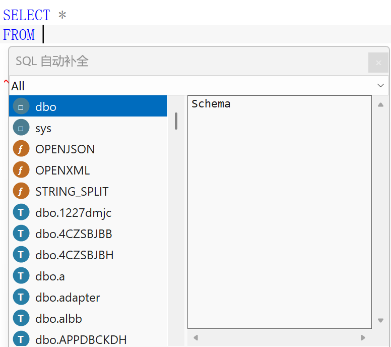
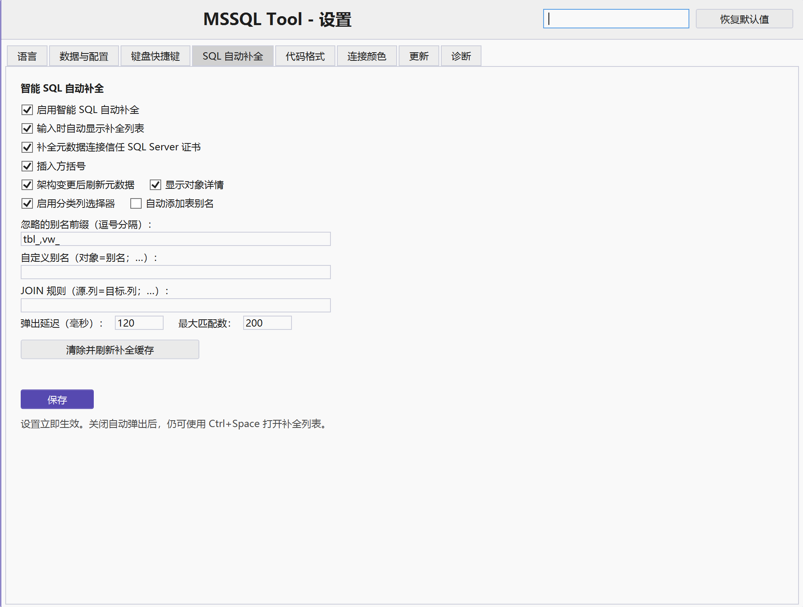
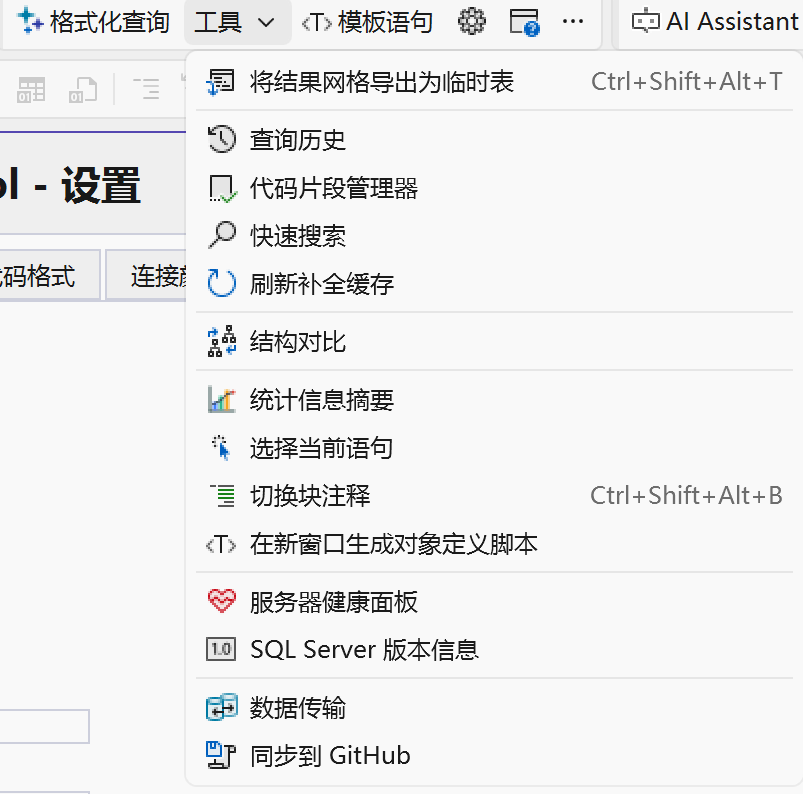

# MSSQL Tool for SSMS 22

[English](README.md) | [简体中文](README.zh-CN.md)

> MSSQL Tool is a fork of [Axial-SQL/AxialSqlTools](https://github.com/Axial-SQL/AxialSqlTools) (Apache-2.0). The SQL completion engine, the formatter options, and the settings and localization layers were reworked on top of it.

## Screenshots

**Smart SQL completion** - context-aware suggestions while you type: schemas, tables, views, columns, procedures, functions and parameters, each with a kind icon, a category filter and the details of the highlighted object.

**Settings** - every feature has its own options and is saved immediately. The interface follows the SSMS language (Simplified Chinese shown here, English is available too).

**Tools menu** - the extension's commands, with their keyboard shortcuts where one is configured.

## Features

### SQL editing

- **Smart SQL completion:** Context-aware suggestions for databases, schemas, tables, views, columns, procedures, functions, parameters, synonyms, and linked-server objects.
- **Completion metadata cache:** Background loading, manual clear/refresh, loading status feedback, and optional SQL Server certificate trust.
- **F12 Go to Definition:** Opens database object definitions and navigates to local SQL definitions.
- **T-SQL formatting**
- **Query templates and snippets**
- **Expand `SELECT *` to a column list**
- **Select current statement**
- **Toggle block comments**
- **Quick Search**
- **Script object definition**

### Result processing and data transfer

- **Export grid to Excel**
- **Export grid to Google Sheets**
- **Send grid results by email**
- **Export grid as a temporary table**
- **Copy grid column names and values as INSERT, CSV, JSON, XML, or HTML**
- **Bulk data transfer**

### Monitoring and workflow

- **Query History**
- **Server Health Dashboard**
- **Execution statistics summary**
- **Transaction and Always Encrypted warnings**
- **Connection colors for server and database environments**
- **Millisecond query execution time**
- **Right-aligned numeric grid values**
- **SQL Server version information**
- **Sync database scripts to GitHub**
- **Configurable data and settings folder** (another drive, a synced folder or a portable device)
- **Simplified Chinese and English interfaces**

## Support

